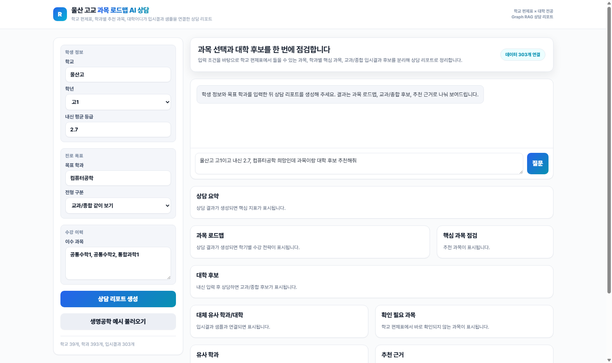

# 울산 고교 과목 로드맵 기반 Graph RAG 진로 컨설팅

2026학년도 울산 지역 고교 편제표와 학과별 추천 과목 DB를 연결해, 예비 고1~고3 학생의 과목 선택과 대학/학과 탐색을 돕는 진로 상담 MVP입니다. 현재는 엑셀 기반 데이터 로딩, 과목 매칭, 학생 조건 기반 추천, 웹 UI 시연까지 구현했으며, Neo4j/NetworkX와 LLM 답변 체인을 붙이는 Graph RAG 구조로 확장할 수 있도록 설계했습니다.

이 프로젝트는 팀 프로젝트 주제를 바탕으로 하지만, 데이터 구조화와 MVP 설계, 검색/추천 흐름, 웹앱 프로토타입 구상은 개인 개발 가능성을 검증하기 위해 별도 정리했습니다.

## 문제 정의

고교학점제와 2028학년도 대입 개편 환경에서는 학생이 학교별 편제표 안에서 어떤 과목을 선택해야 목표 학과와 연결되는지 판단하기 어렵습니다. 특히 같은 학과라도 대학별 권장 과목, 핵심 과목, 전형 반영 방식이 다르고, 학교마다 실제 개설 과목과 선택 슬롯이 다릅니다.

이 프로젝트는 다음 질문에 답하는 것을 목표로 합니다.

- 고1·고2: 현재까지 선택한 과목과 목표 대학/학과를 기준으로 남은 학기 과목 선택 로드맵을 제안할 수 있는가?
- 고3: 학교, 내신, 수강 편제표, 목표 학과를 기준으로 지원 가능한 대학/학과와 유사 학과 대안을 제안할 수 있는가?
- 상담 결과가 단순 LLM 답변이 아니라 편제표, 시행계획, 과목 DB에 근거한 설명으로 제공될 수 있는가?

## 데이터와 공개 범위

| 구분 | 내용 |
| --- | --- |
| 과목 로드맵 DB | `울산고교_과목로드맵_수정.xlsx` 기반. 학교 편제표, 대학트랙, 학과트랙, 과목 별칭, 공식 과목명, 로드맵 집계 시트 포함 |
| 학교 편제표 | 울산 지역 고교 2026학년도 신입생/전학년 교육과정 편제표 79개 |
| 대학 시행계획 | 2028학년도 대학입학전형 시행계획 PDF/HWP 82개 |
| 과목 선택 자료 | 고려대, 연세대, 이화여대, 경북대 과목 선택 자료 4개 |
| 기존 웹앱 | Google Sheets + Apps Script + HTML 기반 과목 로드맵 조회 웹앱 코드 |

원본 XLSX/PDF/HWP 데이터는 저작권 및 개인정보 검토 문제로 공개하지 않습니다. 공개 저장소에는 샘플 엑셀, 공개 가능한 커리어넷 선택과목 CSV, 구조 설명, 변환/수집 스크립트 중심으로 제공합니다.

자세한 데이터 현황은 [docs/data-inventory.md](docs/data-inventory.md)에 정리했습니다.

## 핵심 아이디어

Graph RAG는 "문서 검색 후 답변"만 하는 방식보다 이 문제에 잘 맞습니다. 학생 상담에는 학교, 학년, 학기, 선택 슬롯, 과목, 학과, 대학, 전형, 권장 과목 같은 관계가 중요하기 때문입니다.

다만 현재 저장소는 Neo4j/NetworkX 기반 그래프 DB나 외부 LLM 답변 체인을 완성한 단계가 아닙니다. 현재 구현은 엑셀 데이터를 읽어 메모리에서 관계를 구성하고, 학생 조건에 맞는 과목과 후보를 규칙 기반으로 추천하는 MVP입니다.

예상 그래프 구조:

```text
School -> CurriculumSlot -> Subject
Subject -> MajorTrack -> Major
University -> AdmissionPlan -> Major
Major -> SimilarMajor -> Major
StudentProfile -> TakenSubject / TargetMajor / GradeBand
```

향후 LLM 답변 체인은 그래프 검색 결과를 바탕으로 다음을 수행하도록 확장할 계획입니다.

- 학생 조건을 구조화된 질의로 변환
- 학교 편제표 안에서 실제 선택 가능한 과목만 필터링
- 목표 학과의 핵심/권장 과목 충족도를 계산
- 내신컷 데이터가 추가되면 지원권/상향/안정 후보를 분류
- 추천 근거를 학생이 이해할 수 있는 상담 문장으로 설명

## 현재 구현 완료

- 엑셀 로드맵 DB 로딩
- 학교별 개설 과목 추출
- 학과별 핵심/권장/참고 과목 매칭
- 학생 조건 기반 과목 추천
- 학기별 과목 로드맵 생성
- 커리어넷 학과별 2022 개정 선택과목 CSV 연동
- 웹 UI 기반 상담 리포트 시연

## 향후 구현 계획

- Neo4j 또는 NetworkX 기반 그래프 저장
- FastAPI 전환
- LLM 답변 체인 연결
- 내신컷 데이터 확장
- 실제 배포용 샘플 데이터 정비

## 저장소 구조

```text
roadmap_project/
  app/                  # 상담 리포트 웹 UI
  roadmap_rag/          # 엑셀 기반 메모리 그래프 로더와 추천 엔진
  server.py             # 표준 라이브러리 기반 챗봇 API 서버
  data/                 # 공개 가능한 샘플/메타 데이터
  docs/                 # 설계 문서
  scripts/              # 데이터 점검 및 변환 스크립트
```

## 실행 방법

챗봇 MVP는 [server.py](server.py)가 엑셀 로드맵 DB를 읽어 메모리 그래프를 만들고, [app/index.html](app/index.html)에서 `/api/chat`으로 질의하는 방식으로 동작합니다.

### 공개 샘플 데이터로 실행

공개 저장소에는 원본 로드맵 엑셀 대신 `data/sample_roadmap.xlsx`가 포함되어 있습니다. 저장소를 클론한 뒤 아래 명령으로 샘플 상담 UI를 확인할 수 있습니다.

```powershell
pip install -r requirements.txt
python server.py
```

브라우저에서 `http://localhost:8000` 접속

샘플 엑셀을 다시 만들고 싶다면 아래 명령을 실행합니다.

```powershell
python scripts\create_sample_workbook.py
```

### 원본 엑셀 데이터로 실행

개인 로컬 환경에서 원본 `울산고교_과목로드맵_수정.xlsx`를 사용하는 경우에는 파일 경로를 직접 넘깁니다.

```powershell
python server.py --workbook ..\울산고교_과목로드맵_수정.xlsx
```

원본 파일이 없으면 서버는 “원본 로드맵 엑셀 파일을 찾을 수 없습니다. README의 데이터 준비 방법을 확인하세요.”라는 안내 메시지를 출력하고 종료합니다.

### 시연 화면



학교, 학년, 내신, 목표 학과, 이수 과목을 입력해 과목 로드맵과 대학 후보 상담 리포트를 생성하는 화면입니다.

API 테스트:

```powershell
Invoke-WebRequest -Uri http://localhost:8000/api/chat `
  -Method POST `
  -ContentType "application/json; charset=utf-8" `
  -Body '{"message":"울산고 고1이고 컴퓨터공학 희망인데 과목 추천해줘","profile":{"school":"울산고","grade":1,"major":"컴퓨터공학","taken":"공통수학1, 공통수학2, 통합과학1"}}'
```

공개 샘플 데이터만 사용할 경우 대학 입시결과 후보 추천은 제한됩니다. 내신컷 기반 대학 후보 추천은 공개 저장소에 포함하지 않은 별도 입시결과 CSV가 있을 때 활성화됩니다.

GitHub 업로드 절차는 [docs/github-publish.md](docs/github-publish.md)에 정리했습니다.

## 한계와 윤리

본 서비스는 입시 결과를 보장하지 않습니다. 대학별 시행계획은 변경될 수 있고, 내신컷은 연도·전형·모집단위에 따라 달라집니다. 따라서 결과 화면에는 항상 데이터 기준일, 사용한 근거, 불확실성, 최종 확인 필요 문구를 함께 표시해야 합니다.
